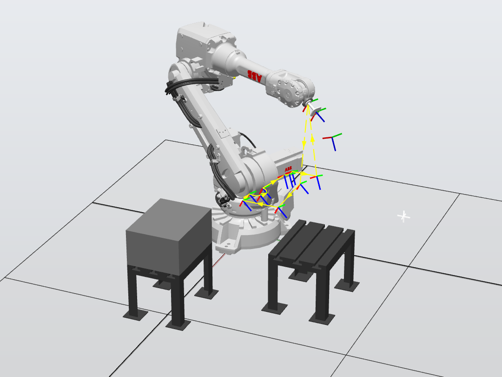

# 2026-009-ABB机器人实践

> ABB RobotStudio 实习实践项目，面向 IRB 2600-12/1.65 工站仿真、吸盘抓取与 RAPID 路径编程

## 项目效果图

## 项目内容

1. **ABB实训工站一**
`a1-ABBPracticalTraining/` 为 RobotStudio 工站 ABBPracticalTraining。机型 IRB 2600-12/1.65 Type C，RobotWare 6.12.1014（中文、DeviceNet Master/Slave）。工站含吸盘工具 Tool_suck、工作台 table_and_fixture_140、工件「部件_1」，以及 SmartComponent_1（Attacher、Detacher、LogicGate、LineSensor），将控制器输出 do0 接到 di0。RAPID 主程序 `MainModule.mod` 使用 MoveAbsJ、MoveJ 与 Set/Reset do0 完成抓放路径。目录含 Station、Controller Data 与 Virtual Controllers。

2. **ABB实训工站二**
`a2-ABBPracticalTraining_1/` 为 RobotStudio 工站 ABBPracticalTraining_1。同为 IRB 2600-12/1.65，RobotWare 英文选项。含工具库 `Tool_suck.rslib`、末端工具 MyTool（SpintecTool）与工作台 table_and_fixture_140。RAPID 模块 `Module1.mod`（作者 cyx）使用 MoveAbsJ、MoveJ、MoveL、MoveC 编写直线与圆弧路径。目录含 Station 与 Controller Data。

3. **代码工站**
`b-Code/` 为 RobotStudio 工程 9-Code，含工站 `Station/9-Code.rsstnx`。当前工站为默认空站，仅有 RAPID 任务框架，未配置机器人本体与控制器数据。

4. **项目图片**
`b-Picture/` 存放 `效果图.png` 与 `Logo.png`。

5. **演示视频**
`b-Video/` 存放现场演示 `现场演示效果.mp4`，以及 `ABBPracticalTraining.exe`、`ABBPracticalTraining-2.exe`。

## 保留内容
- 本模板项目介绍：此为最初的准备的项目模板
 每个分支项目都会由他去继承
- 作者：Pinavia - 2025

